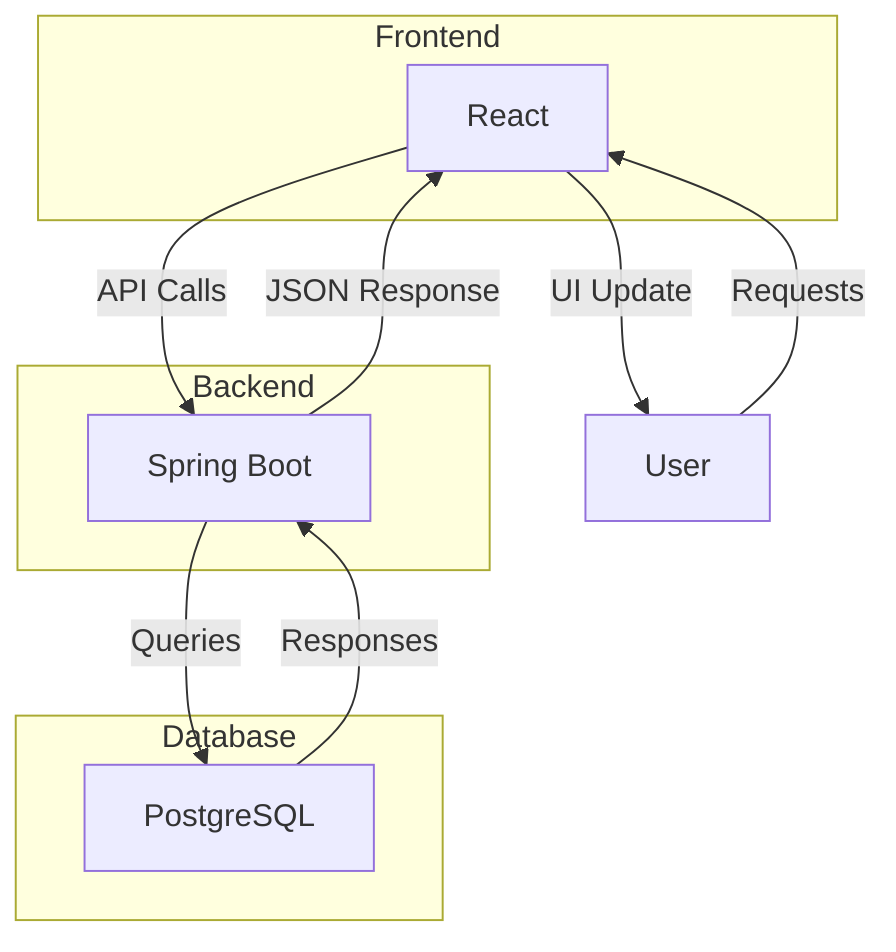

# TODO App for Otel

OpenTelemetryの勉強用のTODOアプリです。

アーキテクチャは以下の通り

```mermaid
graph TD;
    subgraph Frontend
        React[React]
    end

    subgraph Backend
        SpringBoot[Spring Boot]
    end

    subgraph Database
        PostgreSQL[PostgreSQL]
    end

    User[User] -->|Requests| React
    React -->|API Calls| SpringBoot
    SpringBoot -->|Queries| PostgreSQL
    PostgreSQL -->|Responses| SpringBoot
    SpringBoot -->|JSON Response| React
    React -->|UI Update| User
```